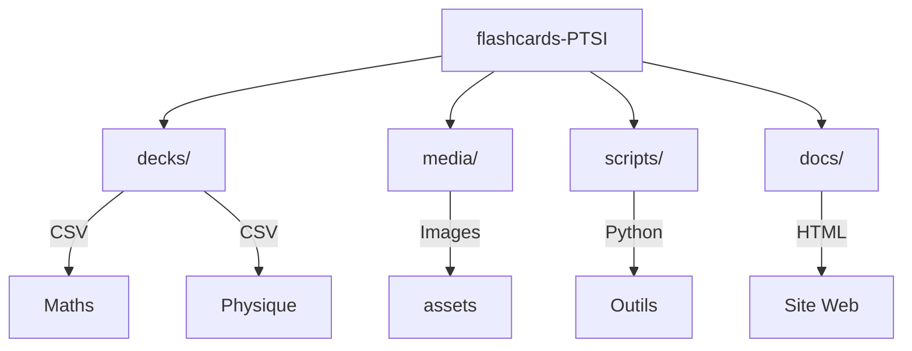

# 📚 Flashcards PTSI Collaboratives

> **Un projet communautaire pour partager et améliorer ses méthodes de révision en PTSI.**

[Qu'est-ce que Anki ?](https://www.ac-paris.fr/anki-l-application-pour-memoriser-et-reviser-128726) · [Site officiel Anki](https://apps.ankiweb.net) · [Documentation Anki](https://docs.ankiweb.net/)

## 📥 Télécharger les Decks

👉 **[Accéder à la bibliothèque de decks (Maths, Physique, SI...)](https://cermp.github.io/flashcards-ptsi/decks)**

---

## 🤝 Comment Contribuer

### Prérequis

1.  **[Anki Desktop](https://apps.ankiweb.net/)** installé.
2.  **[AnkiConnect](https://ankiweb.net/shared/info/2055492159)** (Add-on n°`2055492159`) configuré.
3.  **[CardsCompanionApp](https://github.com/CermP/CardsCompanionApp/releases/latest)** (macOS) pour exporter facilement.
4.  Un compte **GitHub**.

### Façon simple : Modifier sur GitHub

Pour corriger une coquille ou une erreur :
1.  Va dans le dossier `decks/` et trouve le fichier CSV concerné.
2.  Clique sur le crayon ✏️ pour éditer.
3.  Fais tes modifications et commit (« Propose changes »).

### Façon complète : Ajouter des decks via Anki

1.  Clone le dépôt :
    ```bash
    git clone https://github.com/CermP/flashcards-ptsi.git
    cd flashcards-ptsi
    ```
2.  Crée tes decks dans Anki.
3.  Utilise **CardsCompanionApp** (ou lance `python3 scripts/export_with_media.py`) pour exporter vers le dossier du dépôt.
4.  Fais une Pull Request avec tes changements !

---

## 🛠️ Structure du Projet



## 📜 Scripts Disponibles

Les scripts se trouvent dans le dossier `scripts/`.

| Script | Description | Commande |
| :--- | :--- | :--- |
| `export_with_media.py` | Exporte les decks Anki vers CSV + Images | `python3 scripts/export_with_media.py` |
| `imports_decks.py` | Importe tous les CSV du dépôt dans Anki | `python3 scripts/imports_decks.py` |
| `generate_apkg.py` | Génère les fichiers `.apkg` pour le site | `python3 scripts/generate_apkg.py` |
| `generate_index.py` | Met à jour l'index du site web | `python3 scripts/generate_index.py` |

> 💡 **Note :** Les dépendances Python requises sont `genanki`. Installez-les avec `pip install genanki`.

---

## 🔗 Liens Utiles

- [🌐 Page de Decks](https://cermp.github.io/flashcards-ptsi/)
- [📱 CardsCompanionApp](https://github.com/CermP/CardsCompanionApp/releases/latest)
- [🐛 Signaler un problème](https://github.com/CermP/flashcards-ptsi/issues)

**Merci à tous les contributeurs !** ❤️
